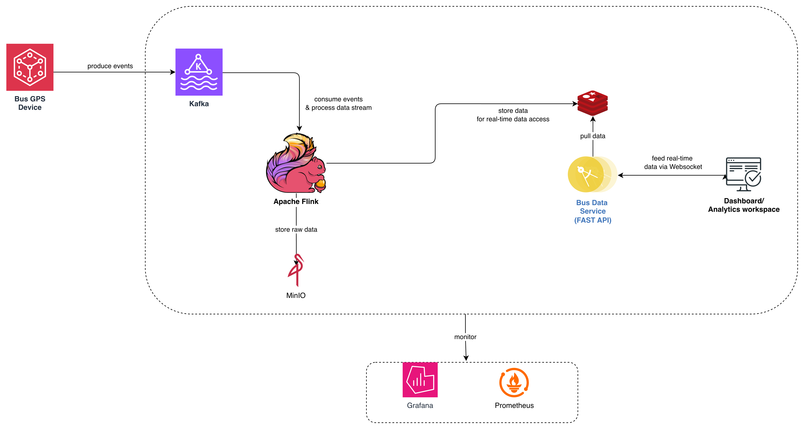

# Ho Chi Minh City Real-Time Bus Tracking

**Dataset:** 32 GB - 517 JSON files - ~109 Million GPS records - 440 buses - 31 routes - duration 50 days (Mar 20 – May 10 2025)  
**Technology Stack:** Kafka → Flink (Java 17) → Redis + MinIO → FastAPI + React UI → Prometheus + Grafana  
**Deployment:** Single `docker-compose up --build` — 17 Docker services

---

## Quick Start

Copy the example below into a `.env` file at the project root and set `DATASET_PATH` to the folder containing `sub_raw_*.json` files:

```env
# ── Replay Speed ──────────────────────────────────────────────────────────────
# 0   = max throughput
# 1.0 = real-time (based on the actual timestamps recorded in the data)
# N   = Nx accelerated (e.g. 10 = 10x faster than real-time)
REPLAY_SPEED=3

# ── Kafka ─────────────────────────────────────────────────────────────────────
KAFKA_BOOTSTRAP_SERVERS=kafka:9092
KAFKA_TOPIC=bus-gps-events
KAFKA_PARTITIONS=3
KAFKA_REPLICATION_FACTOR=1

# ── Redis ─────────────────────────────────────────────────────────────────────
REDIS_HOST=redis
REDIS_PORT=6379
BUS_STATE_TTL_SECONDS=3600

# ── MinIO (local S3) ─────────────────────────────────────────────────────────
MINIO_ENDPOINT=http://minio:9000
MINIO_ACCESS_KEY=minioadmin
MINIO_SECRET_KEY=minioadmin
MINIO_BUCKET=bus-history

# ── Flink ─────────────────────────────────────────────────────────────────────
FLINK_PARALLELISM=2
WINDOW_SIZE_SECONDS=60
WATERMARK_DELAY_SECONDS=30
DEDUP_TTL_SECONDS=60

# ── Dataset ───────────────────────────────────────────────────────────────────
DATASET_PATH=/path/to/BigData-Bus-DataSet

# ── Grafana ───────────────────────────────────────────────────────────────────
GF_ADMIN_PASSWORD=admin
```

Then run:

```bash
./run.sh            # start all 17 services
./run.sh --stop     # stop containers (keep volumes)
./run.sh --clean    # stop containers + delete volumes
./run.sh --rebuild  # rebuild JAR + images, then restart
./run.sh --logs     # watch the logs
./run.sh --status   # show which services are up
```

### Required Ports

| Port | Service |
|------|---------|
| 2182 | Zookeeper |
| 29092 | Kafka |
| 8888 | Kafka UI |
| 6379 | Redis |
| 9000 | MinIO API |
| 9001 | MinIO Console |
| 8081 | Flink Web UI |
| 9249 | Flink JobManager metrics |
| 9250 | Flink TaskManager metrics |
| 8000 | FastAPI |
| 3002 | React Dashboard |
| 9090 | Prometheus |
| 3001 | Grafana |

---

## Architecture



```
Bus GPS Files (32 GB)
       │  producer.py — producing the bus events
       ▼
  Apache Kafka  (topic: bus-gps-events)
       │
       ▼
  Apache Flink  (5-stage streaming pipeline)
  ┌──────────────────────────────────────────────┐
  │ 1. CoordinateValidatorProcess  (data quality)            │
  │ 2. BloomFilterDeduplicator     (deduplication)           │
  │ 3. AnomalyDetector             (speed / jump  calculate) │
  │ 4a. RedisSink                  (current state)│
  │ 4b. SlidingEventTimeWindows    (route speed calculate)   │
  │ 4c. EventTimeSessionWindows    (trip segments)           │
  │ 4d. TumblingEventTimeWindows   (raw archive)             │
  │ 4e. TumblingEventTimeWindows 1h (features)               │
  └──────────────────────────────────────────────┘
       │                    │
       ▼                    ▼
    Redis               MinIO (or S3 in clloud)
  current state       historical archive
  Pub/Sub relay       trip segments
  anomaly list        feature vectors

  FastAPI (REST + WebSocket)  →  React + dashboard
  Prometheus + Grafana monitoring
```

---

## Demo Walkthrough

### 1. Live Bus Map — `http://localhost:3002`

Within 5–10 seconds buses appear as coloured dots on the HCMC map.

- Watch dots shift position as GPS events arrive via WebSocket
- Click a dot to see bus details: route, speed, status, and last update time
- Header shows live bus count; sidebar shows per-route breakdown

---

### 2. Flink Job Graph — `http://localhost:8081`

**Running Jobs** → **"Bus GPS Tracking Pipeline"**

- Job graph shows the full operator DAG
- Click any operator → records in/out per second
- **Checkpoints** tab → duration, size, lag
---

### 3. Kafka UI — `http://localhost:8888`

**Topics** → `bus-gps-events` → **Messages**

- Messages partitioned across 3 partitions by vehicle hash
- **Consumer Groups** → `bus-tracking-flink`
---

### 4. MinIO Console — `http://localhost:9001`

Credentials: `minioadmin` / `minioadmin`

**Object Browser** → `bus-history` bucket. After ~60–90 seconds:

- `{date}/{HH-mm}/` — JSON arrays of raw GPS events
- `trips/` — one `TripSegment` JSON per completed bus trip
- `features/vehicle-hourly/` — 12-dimension `VehicleFeatureVector` per vehicle per hour

---

### 5. Grafana Dashboard — `http://localhost:3001`

Credentials: `admin` / `admin`

**Dashboards** → **"Bus GPS Pipeline"** (auto-provisioned, 8 panels):

| Panel | What it shows |
|-------|--------------|
| Flink Records In/sec | Kafka source throughput |
| Flink Records Out/sec | Post-dedup throughput (~0.6% lower) |
| Kafka Consumer Lag | expect 0 |
| Active Buses | Redis key count; reaches ~440 |
| Redis Commands/sec | HSET + EXPIRE + PUBLISH volume |
| Flink Checkpoint Duration | expect < 1000 ms |
| Kafka Messages In/sec | Per-partition throughput |
| Redis Memory Used (MB) |

---

### 6. Replay Speed

```bash
docker-compose stop producer
# Edit .env for REPLAY_SPEED=1.0  (real-time) or REPLAY_SPEED=0 (max speed)
docker-compose start producer
```

---

### 8. Stale Bus Detection

```bash
docker-compose stop producer
docker-compose start producer
```

---

## Offline Notebooks

Run after the pipeline has been active for 10–15 minutes.  
See **[offline-notebooks.md](offline-notebooks.md)** for guideline.

| Notebook | What it does |
|----------|-------------|
| `01_stop_detection.ipynb` | State machine + DBSCAN stop clustering |
| `02_travel_time.ipynb` | Trip duration heatmap + April 30 impact |
| `03_congestion_heatmap.ipynb` | Group speeds by location and show them on a map |
| `04_pca_analysis.ipynb` | Reduce data to 12 key features, then show importance and feature contribution |
| `05_anomaly_analysis.ipynb` | Anomaly distribution + temporal clustering |


